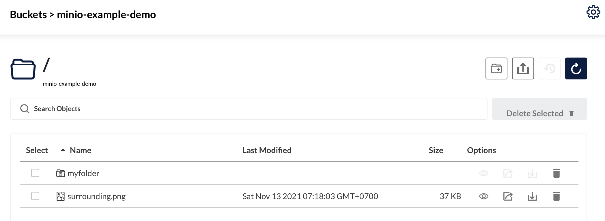
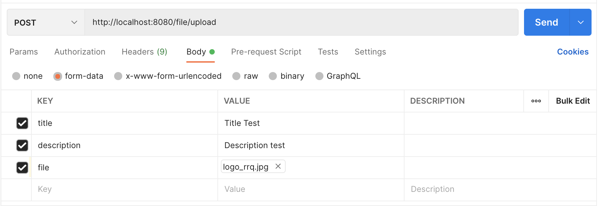

## Cloud Object Storage Spring Boot With Minio

[](https://docs.min.io/docs/minio-quickstart-guide.html)

MinIO is a High Performance Object Storage released under GNU Affero General Public License v3.0. It is API compatible with Amazon S3 cloud storage service. Use MinIO to build high performance infrastructure for machine learning, analytics and application data workloads.

Minio allows the upload and download of files for containerized applications, respecting the interfaces of Amazon S3 solution. The Minio API is requested as HTTP, which allows interoperability regardless of the framework or language used.

In the article, I would use the following terms, which are specific to Minio or S3
- Bucket: Contains a set of files.
- Prefix : Virtually, this is a set of directories in which the file is located. All the files are arranged at the root of the bucket, and have a prefix of kind my/prefix/file.pdf.

Minio is a self-hosted solution, you can install it by following instructions here.
There is also a public instance to test on `https://play.min.io/minio/`. You can use the following credentials :
```text
Access Key : minioadmin
Secret Key : minioadmin
```

**Run Standalone MinIO on Docker**

MinIO needs a persistent volume to store configuration and application data. However, for testing purposes, you can launch MinIO by simply passing a directory (/data in the example below). This directory gets created in the container filesystem at the time of container start. But all the data is lost after container exits.

```bash
docker run \
  -p 9000:9000 \
  -p 9001:9001 \
  -e "MINIO_ROOT_USER=<USERNAME>" \
  -e "MINIO_ROOT_PASSWORD=<PASSWORD>" \
  quay.io/minio/minio server /data --console-address ":9001"
```

### Project Setup and Dependencies

I'm depending [Spring Initializr](https://start.spring.io/) for this as it is much easier. And we have to create two spring boot projects and started with maven project.

Our example application will be a Spring Boot application. So we need to add some dependencies to our `pom.xml`.

```xml
<dependency>
    <groupId>org.springframework.boot</groupId>
    <artifactId>spring-boot-starter-web</artifactId>
</dependency>

<dependency>
    <groupId>org.projectlombok</groupId>
    <artifactId>lombok</artifactId>
    <version>1.18.12</version>
    <scope>provided</scope>
</dependency>

<dependency>
    <groupId>io.minio</groupId>
    <artifactId>minio</artifactId>
    <version>8.3.0</version>
</dependency>

<dependency>
    <groupId>com.squareup.okhttp3</groupId>
    <artifactId>okhttp</artifactId>
    <version>4.9.1</version>
</dependency>

<dependency>
    <groupId>commons-io</groupId>
    <artifactId>commons-io</artifactId>
    <version>2.11.0</version>
</dependency>
```

Change configuration `application.properties` file like following below. I will use `play.min.io` to this documentation which is open source and for demo the other projects.

```text
server.port=8080
spring.servlet.multipart.max-file-size=2MB

# Minio
minio.bucket.name=minio-example-demo
minio.access.key=minioadmin
minio.access.secret=minioadmin
minio.url=https://play.min.io
```

**Upload Some Image on Minio**

I will create folder inside the `minio-example-demo` bucket is `myfolder` and upload some images.



### Implementation

**Bean Configuration**

Create bean configuration that can be used for dependency injection on `com.piinalpin.minio.config.MinioConfiguration` like following below.

```java
@Configuration
public class MinioConfiguration {

    @Value("${minio.access.key}")
    private String accessKey;

    @Value("${minio.access.secret}")
    private String secretKey;

    @Value("${minio.url}")
    private String minioUrl;

    @Bean
    @Primary
    public MinioClient minioClient() {
        return new MinioClient.Builder()
                .credentials(accessKey, secretKey)
                .endpoint(minioUrl)
                .build();
    }

}
```

**Data Transfer Object**

Create a dto class to construct object even for request or response `com.piinalpin.minio.http.dto.FileDto` like following below.

```java
@Data
@Builder
@NoArgsConstructor
@AllArgsConstructor
@JsonNaming(PropertyNamingStrategies.SnakeCaseStrategy.class)
@JsonInclude(JsonInclude.Include.NON_NULL)
public class FileDto implements Serializable {

    private static final long serialVersionUID = 232836038145089522L;

    private String title;

    private String description;

    @SuppressWarnings("java:S1948")
    private MultipartFile file;

    private String url;

    private Long size;

    private String filename;

}
```

**Get List Objects from Bucket**

Create service to get list objects inside bucket at `om.piinalpin.minio.service.MinioService` like following below. First we should inject `MinioClient` to use minio and define bucket name get from `properties` file.

```java
@Autowired
private MinioClient minioClient;

@Value("${minio.bucket.name}")
    private String bucketName;
```

Create method to get list objects from bucket in minio like following below.

```java
@Slf4j
@Service
public class MinioService {

    @Autowired
    private MinioClient minioClient;

    @Value("${minio.bucket.name}")
    private String bucketName;

    public List<FileDto> getListObjects() {
        List<FileDto> objects = new ArrayList<>();
        try {
            Iterable<Result<Item>> result = minioClient.listObjects(ListObjectsArgs.builder()
                    .bucket(bucketName)
                    .recursive(true)
                    .build());
            for (Result<Item> item : result) {
                objects.add(FileDto.builder()
                        .filename(item.get().objectName())
                        .size(item.get().size())
                        .url(getPreSignedUrl(item.get().objectName()))
                        .build());
            }
            return objects;
        } catch (Exception e) {
            log.error("Happened error when get list objects from minio: ", e);
        }

        return objects;
    }

    private String getPreSignedUrl(String filename) {
        return "http://localhost:8080/file/".concat(filename);
    }

}
```

Create a controller to interacted with user to get list objects of bucket `com.piinalpin.minio.http.controller.FileController` like following below.

```java
@Slf4j
@RestController
@RequestMapping(value = "/file")
public class FileController {

    @Autowired
    private MinioService minioService;

    @GetMapping
    public ResponseEntity<Object> getFiles() {
        return ResponseEntity.ok(minioService.getListObjects());
    }

}
```

Let's try to running spring boot application by typing command on your terminal like following below.

```bash
mvn spring-boot:run 
```

And open your postman or thunder client or anything else to get list objects of bucket by accessing `http://localhost:8080/file`. Then we should get an output.

```json
[
  {
    "url": "http://localhost:8080/file/myfolder/microservices-portable-networkjpg.jpg",
    "size": 25816,
    "filename": "myfolder/microservices-portable-networkjpg.jpg"
  },
  {
    "url": "http://localhost:8080/file/surrounding.png",
    "size": 37600,
    "filename": "surrounding.png"
  }
]
```

**Upload File into Minio**

Create method in `MinioService` to upload file like following below.

```java
public FileDto uploadFile(FileDto request) {
    try {
        minioClient.putObject(PutObjectArgs.builder()
                .bucket(bucketName)
                .object(request.getFile().getOriginalFilename())
                .stream(request.getFile().getInputStream(), request.getFile().getSize(), -1)
                .build());
    } catch (Exception e) {
        log.error("Happened error when upload file: ", e);
    }
    return FileDto.builder()
            .title(request.getTitle())
            .description(request.getDescription())
            .size(request.getFile().getSize())
            .url(getPreSignedUrl(request.getFile().getOriginalFilename()))
            .filename(request.getFile().getOriginalFilename())
            .build();
}
```

Create another controller to handle upload file like following below.

```java
@PostMapping(value = "/upload")
public ResponseEntity<Object> upload(@ModelAttribute FileDto request) {
    return ResponseEntity.ok().body(minioService.uploadFile(request));
}
```

Let's try to running spring boot application by typing command on your terminal like following below.

```bash
mvn spring-boot:run 
```

And open your postman or thunder client or anything else to get list objects of bucket by accessing `http://localhost:8080/file/upload` with method `POST`. The request should like below.



And we should get an output.

```json
{
  "title": "Maverick",
  "description": "Maverick description",
  "url": "http://localhost:8080/file/logo_rrq.jpg",
  "size": 87624,
  "filename": "logo_rrq.jpg"
}
```

**Download File from Minio**

Create method in `MinioService` to get object from minio and transfer it to response `application/octet-stream` like following below.

```java
public InputStream getObject(String filename) {
    InputStream stream;
    try {
        stream = minioClient.getObject(GetObjectArgs.builder()
                .bucket(bucketName)
                .object(filename)
                .build());
    } catch (Exception e) {
        log.error("Happened error when get list objects from minio: ", e);
        return null;
    }

    return stream;
}
```

Create another controller to download file with dynamic path variables like following below.

```java
@GetMapping(value = "/**")
public ResponseEntity<Object> getFile(HttpServletRequest request) throws IOException {
    String pattern = (String) request.getAttribute(BEST_MATCHING_PATTERN_ATTRIBUTE);
    String filename = new AntPathMatcher().extractPathWithinPattern(pattern, request.getServletPath());
    return ResponseEntity.ok()
            .contentType(MediaType.APPLICATION_OCTET_STREAM)
            .body(IOUtils.toByteArray(minioService.getObject(filename)));
}
```

Let's try to running spring boot application by typing command on your terminal like following below.

```bash
mvn spring-boot:run 
```

And open your browser to get list objects of bucket by accessing `http://localhost:8080/file/{filename}`. Change `{filename}` to your filename or object name on minio bucket. For example I will use inside `myfolder`, so the url shoul be like this `http://localhost:8080/file/myfolder/microservices-portable-networkjpg.jpg`. Then the browser should be auto download the file.

### Clone or Download

You can clone or download this project at

```bash
https://github.com/piinalpin/minio-example.git
```

### Reference

- [MinIO Quickstart Guide](https://docs.min.io/docs/minio-quickstart-guide.html)
- [MinIO Docker Quickstart Guide](https://docs.min.io/docs/minio-docker-quickstart-guide.html)  
- [Minio and Spring Boot with Minio starter](https://medium.com/@kaoxyd/minio-and-spring-boot-with-minio-starter-d7efcce5f99a)
- [Spring boot: uploading and downloading file from Minio object store](https://blogs.ashrithgn.com/spring-boot-uploading-and-downloading-file-from-minio-object-store/)